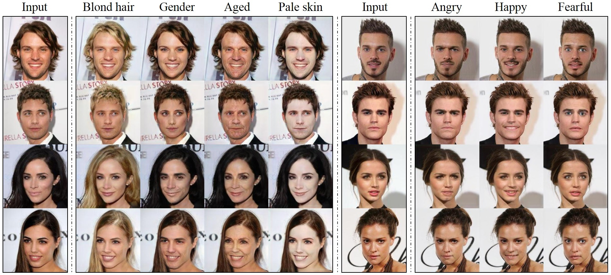

<p align="center"></p>

--------------------------------------------------------------------------------
This repository provides a optimized tensorflow implementation of [StarGAN](https://arxiv.org/abs/1711.09020).

<p align="center"></p>

<br/>

## Paper
[StarGAN: Unified Generative Adversarial Networks for Multi-Domain Image-to-Image Translation](https://arxiv.org/abs/1711.09020) <br/>
IEEE Conference on Computer Vision and Pattern Recognition ([CVPR](http://cvpr2018.thecvf.com/)), 2018 (<b>Oral</b>) 

<br/>

## Dependencies
* [Python 2.7](https://www.python.org/)
* [PyTorch 0.4.0](http://pytorch.org/)
* [TensorFlow 1.3+](https://www.tensorflow.org/)

## Getting started

### 1. Clone the code
```bash
git clone https://github.com/HeroKillerEver/StarGAN-tensorflow.git
cd StarGAN-tensorflow
```

### 2. Download the dataset

To download the CelebA dataset:
```bash
$ bash download.sh celeba
```

### 3. Preprocess the dataset
```bash
python util.py
```

### 4. Training
```bash
python main.py
```

you may also type
```bash
python main.py --help
```
to see all of the input arguments


## Author

Haibin Yu [@HeroKillerEver](https://github.com/HeroKillerEver)